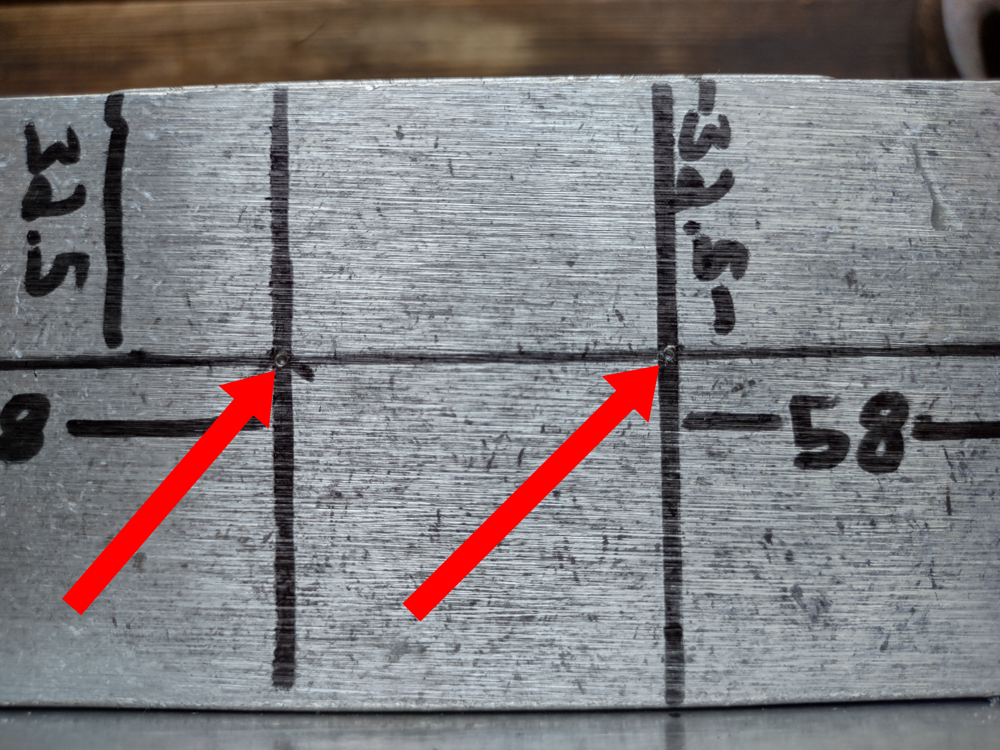
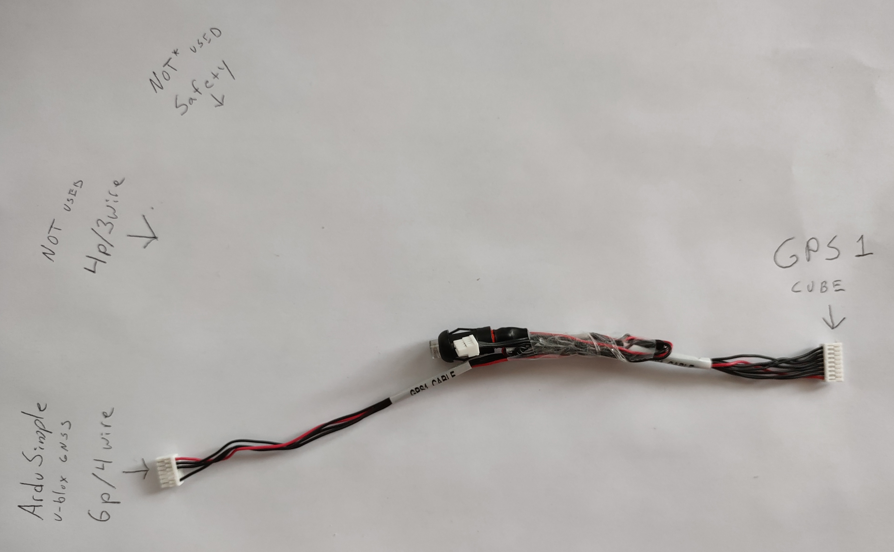
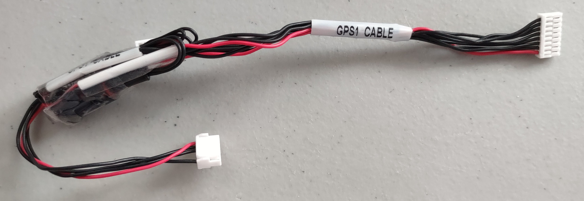

## OxChief Electronics Box Setup

### Parts List

| # | Part | Description / Notes |
|---:|---|---|
| 1 | [Raspberry Pi 5](https://www.ebay.com/itm/116326708617) | Raspberry Pi OS (64-bit). The linked part is from Fun and Tech (eBay) with external antenna mod. |
| 2 | [Flight Controller — Cube Orange](https://irlock.com/products/cube-orange-plus-standard-set) | Officially supported. |
| 3 | [OxChief Autopilot Adapter Set](https://shop.oxchief.com/products/oxchief-raspberry-pi-to-cube-autopilot-adapter-set) | Adapter for Pi ↔ Cube communication. |
| 4 | [SD card for Pi — Samsung Pro Endurance 128GB](https://www.amazon.com/dp/B09WB1857W/) | Endurance microSD recommended. |
| 5 | [ArduSimple SimpleRTK2B starter kit (u-blox ZED-F9P)](https://www.ardusimple.com/product/simplertk2b-basic-starter-kit-ip65/) | GNSS receiver & antenna, supported. |
| 6 | [RM3100 magnetometer](https://www.getfpv.com/mateksys-ap-periph-can-magnetometer-rm3100.html) | External compass (also available at [ReadyMadeRC](https://www.readymaderc.com/products/details/matek-ap-periph-can-magnetometer-rm3100)). |
| 7 | [Aluminum enclosure — Bud AN-2823-A](https://www.mouser.com/ProductDetail/Bud-Industries/AN-2823-A?qs=9qK3lZr%252bi0IAMON5kROY8A%3D%3D) and [mounting plate — Bud ANX-91323](https://www.mouser.com/ProductDetail/Bud-Industries/ANX-91323?qs=hFSnKGZfZOZx7rEIKm0bLw%3D%3D) | Aluminum recommended for heat dissipation. |
| 8 | [4-to-1 USB Hub](https://www.amazon.com/dp/B00XMD7KPU) | For extra devices. |
| 9 | [Heat-shrink solder](https://www.amazon.com/dp/B0BKSJQC9Q) | Heat-shrink solder connections. |
| 10 | [Rubber grommets](https://www.amazon.com/dp/B0B5VYYSCM/) | Protect cable entries. |
| 11 | [Velcro squares](https://www.amazon.com/dp/B099RXQYFK) | Mounting/padding. |
| 12 | [Conduit & connectors](https://www.amazon.com/dp/B09NNDG19Z) | Liquid-tight connection from main electronics box to obstacle sensor box. |
| 13 | [Nylon standoffs](https://www.amazon.com/dp/B0BN8RP7N8/) | For mounting PCBs. |
| 14 | [Intel RealSense D435f](https://store.realsenseai.com/buy-intel-realsense-depth-camera-d435f.html) | Depth camera. |
| 15 | [1 1/16" hole saw / bit](https://www.amazon.com/dp/B08H78DQQ8/) | For conduit connector. |
| 16 | [Stepped drill bit](https://www.amazon.com/s?k=1+3%2F8+titanium+drill+bit+stepped) | For cable holes. |
| 17 | [12V → USB-C converter](https://www.amazon.com/dp/B0CRVVWL4Y/) | Power Raspberry Pi. |
| 18 | [XT60 connectors](https://www.amazon.com/dp/B0B4H5CCR3) | Power connectors. |
| 19 | [Cutting fluid (optional)](https://www.amazon.com/dp/B00065VEP4/) | Helps when drilling metals. |
| 20 | [Pi active cooler (optional)](https://www.amazon.com/dp/B0CLXZBR5P/) | For Raspberry Pi thermal management. |
| 21 | [12V XT60 power supply (optional)](https://www.amazon.com/s?k=12v+xt60+power+supply) | Packaged supply. |
| 22 | [XT60 splitter (optional)](https://www.amazon.com/s?k=xt60+splitter) | For powering multiple XT60 devices. |
| 23 | [Electrical tape](https://www.amazon.com/dp/B001AXD0EY/) | General wiring protection. |
| 24 | Drill | General tooling. |

### Prepare Box

We will now build the entire autopilot electronics box.

We need to drill 3 holes into the short sides of the electronics box.

- Start with your empty electronics enclosure

- Gather a drill, some cutting fluid, and a stepped drill bit.

- We want to drill 3 holes: 
    - one exactly 1 1/16" hole on the right side (for conduit connector)
    - one roughly 1 3/16" hole on the right side (for rubber grommet)
    - one roughly 1 3/16" hole on the left side (for rubber grommet)

- The first hole should be exactly 1 1/16" for the 90 degree 3/4" liquid tight connector. We use 3/4" electrical conduit to connect the OxChief Obstacle Enclosure in the front of the mower to the autopilot electronics box under the operator seat. We send the following wires in this conduit tunnel: 
    - USB cable connecting the RealSense obstacle sensor in the front of the mower to the Raspberry Pi in the electronics box
    - Power/signal cable between the compass in the obstacle enclosure and the autopilot
    in the electronics box
    - GNSS antenna cable
    - Optional: Raspberry Pi Wifi antenna cable
- The second hole is on the right side.  It should be roughly 1 3/16". We will fit it with a rubber grommet.
- The third hole is on the left side. It should be roughly 1 3/16". This hole is for the servo signal wires and the USB-C cable connecting your Raspberry Pi to your phone (for hotspot tethering). After drilling the hole, you will want to fit in a rubber grommet to protect the wires.

### Add Electronics to Box

- Start with prepped empty box

- Fresh mounting plate 

- Prepped mounting plate. 35mm nylon standoffs are for your Raspberry Pi -- mount them bottom/center as shown. 15mm nylon standoffs are for the ArduSimple u-blox gnss receiver -- they are on the bottom right. Velcro squares on the left for autopilot. Velcro on upper right for USB hub. Electrical tape to ensure OxChief USB adapters don't arc on the mounting plate.  

- Mounting plate in electronics box. Go ahead and attach plate to box with a couple of the included screws (not pictured). 

- Find your Cube Orange autopilot 

- Remove Velcro backing exposing sticky side on the 4 Velcro squares on the left side of the plate. Mount autopilot on Velcro sqares, ensuring that the arrow in the orange Cube is pointing forward. 

- Push the Cube autopilot down with a fair amount of force so that the Velcro sticky side sticks to your Cube. If you'd like, pull up the Cube and notice Velcro is now affixed to back of Cube. 

- Remove backing from two USB hub Velcro pads on the mounting plate, exposing sticky side. Mount USB hub in electronics box. 
- Push the USB hub down with a fair amount of force so that the Velcro sticky side sticks to the hub. If you'd like, pull up the hub and notice Velcro is now affixed to the back of the hub. 
- USB Hub mounted in electronics box 

- Gather the OxChief Raspberry-Pi-to-Cube connectors 

- Connect OxChief OxTelem1 connector to Cube TELEM 1 port and USB hub 

- Connect OxChief OxTelem2 connector to Cube TELEM 2 port and USB hub 

- Connect OxChief OxGPS2 connector to Cube GPS 2 port and USB hub 

- Locate ArduSimple GNSS receiver and a couple of nylon standoffs 

- Mount ArduSimple GNSS receiver in the electronics box with the nylon standoffs 

- Locate u-blox gnss antenna 

- Connect u-blox antenna to ArduSimple GNSS receiver 

- Locate Cube GPS1 Cable 

- For a cleaner looking box, we tape up the 4p connector and safety switch. You won't use the 4p connector. We don't use the safety switch, but you should use it unless you understand the implications of not using it.   

- Connect GPS1 cable from the Cube autopilot to the ArduSimple GNSS receiver 

- Locate a USB-A to Micro-USB cable 

- Connect USB-A end to USB hub and the Micro-USB end to ArduSimple 

- Locate Cube power module. Power cable will connect to Cube POWER1 port 

- Locate a 12v XT60 power supply. Alternatively, make some like these below by soldering XT60 pigtail to a 12V source. 

- Connect the power supply to the power module 

- Connect the power module to the Cube autopilot 

- Power on the system to verify connections. Cube and ArduSimple should power on. Power system back off. 

- Locate your Raspberry Pi 5. Active cooler adorns this one. 

- Locate a DC power converter (12v to 5v) 

- Connect the DC power converter to the Raspberry Pi power adapter 

- Locate  aXT60 splitter to power 2 XT60 connections from 1 source. Alternatively, make your own, as below. 

- Connect the XT60 splitter to the power supply and the DC power converter. Cube pictured below to be clear about how everything is connected. 

- Verify all connections and power on the system 

- Mount Raspberry Pi in enclosure. USB hub and RealSense are connected to Pi USB below. 

- Locate Intel RealSense D435f    
- Connect Tripod and USB cable. 

- Connect RealSense USB to Pi. Ensure RealSense in connected to Pi's blue USB port (USB 3). Connect USB hub to Pi black USB port (USB 2). We want to leave one Pi blue/USB3 port open for tethered cellular data connection later. 