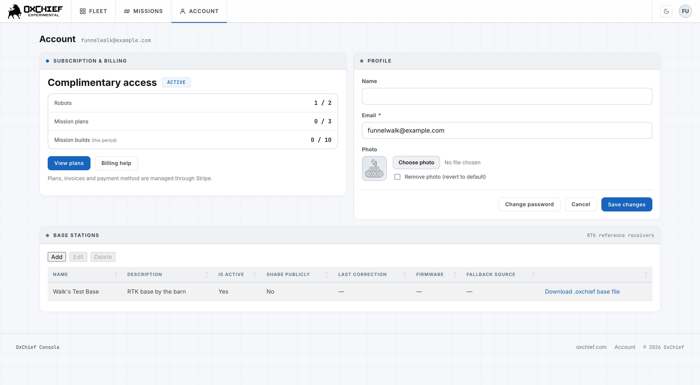
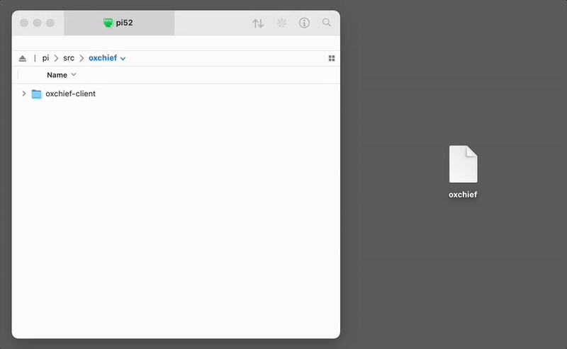
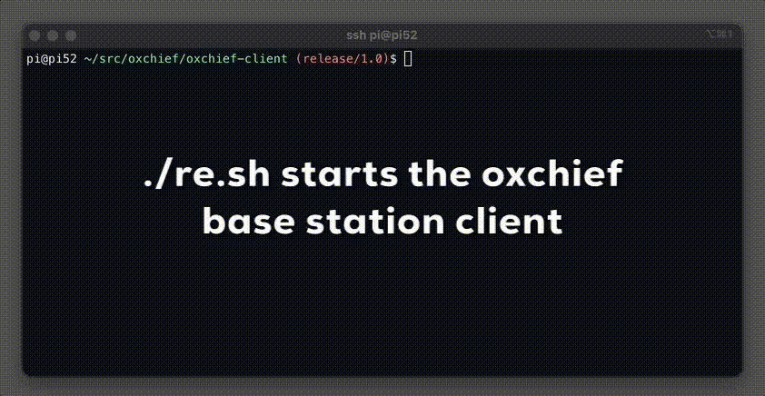

## OxChief Base Station Setup

### Parts List

| # | Part | Notes |
|---:|---|---|
| 1 | [Raspberry Pi 5](https://www.raspberrypi.com/products/raspberry-pi-5/) | Single-board computer for the base station (Pi 5 recommended). |
| 2 | [Raspberry Pi power supply (27W)](https://www.raspberrypi.com/products/27w-power-supply/) | Official PSU to reliably power the Pi. |
| 3 | [ArduSimple SimpleRTK2B (u-blox ZED-F9P)](https://www.ardusimple.com/product/simplertk2b-basic-starter-kit-ip65/) | High-precision GNSS receiver & antenna kit for RTK corrections. |
| 4 | USB cable connecting Raspberry Pi to ZED-F9P | Use an appropriate cable for your receiver (USB-A → USB-C or USB-A → Micro-B depending on module). |

> **Base receiver:** a u-blox ZED-F9P or a Unicore UM982/UM980 both work — RTK corrections are a standard format (RTCM3), so the base does not have to match the receiver on the mower. If your mower runs a UM982 and you already own an F9P/ArduSimple kit, reuse it here as the base. Configure an F9P base to output `1005` + MSM4 (`1074/1084/1094/1124`) + `1230` (GLONASS biases), and survey-in its position.

For sub-inch precision, you're going to want a reliable source of corrections for your GNSS receiver. Our experience has been that owning your own base station is the surest way to make this happen. 

Running your own OxChief GNSS base station has several perks, including:

- No need for cumbersome communications radios -- the RTK corrections are sent and received over your data connection. Your mower will receive corrections wherever you take it. Practically speaking, here's what we mean: you're going to set up the base station once, and you won't think about it again for a long time -- it's just going to work. Your mower will always have solid corrections anywhere you take it within a roughly ~30 mile radius of the base station.
- Super-precise GNSS resolution since you'll often be much closer to your base station that you would a third party base station.
- No additional corrections fee -- base station functionality is included in your OxChief subscription.

With OxChief, you can easliy set up your own rock-solid base station.

Here's how:

### Hardware
1. Connect the Raspberry Pi 4/5 to the u-blox ZED-F9P receiver via USB cable
2. Mount ZED-F9P antenna outside in a clear place with minimal obstruction

### Software
OxChief makes it easy to send corrections from your base station to your robot.

Here's what you're going to do:

1. [Configure your ZED-F9P to output RTCM messages to USB](https://www.youtube.com/watch?v=FpkUXmM7mrc).

2. Hook up the Raspberry Pi to the ZED-F9P via a USB cable.

3. Clone OxChief client source to your Raspberry Pi at `/home/pi/src/oxchief/oxchief-client`.

4. Add a new Base Station in OxChief: log in and open your [Account page](https://oxchief.com/control/account) --> scroll to the "**Base Stations**" table --> click "**Add**", name your base, and save. Then click "**Download .oxchief base file**" in your new base station's row.

5. Copy the `oxchief` file to your base station at `/home/pi/src/oxchief/.oxchief`. Note that the oxchief file downloads as `oxchief`, but you will be adding a `.` to it (and thus naming it `.oxchief`).

6. From the `/home/pi/src/oxchief/oxchief-client` directory, start the base station OxChief client via `./re.sh`.

