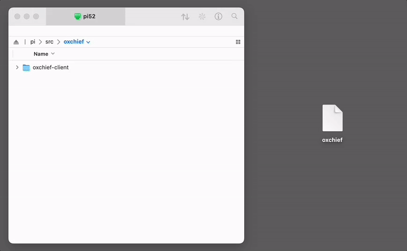

## OxChief Base Station Setup

For sub-inch precision, you're going to want a reliable source of corrections for your GNSS receiver. Our experience has been that owning your own base station is the surest way to make this happen. 

Running your own OxChief GNSS base station has several perks, including:

- No need for cumbersome communications radios -- the RTK corrections are sent and received over your data connection. Your mower will receive corrections wherever you take it. Practically speaking, here's what we mean: you're going to set up the base station once, and you won't think about it again for a long time -- it's just going to work. Your mower will always have solid corrections anywhere you take it within a roughly ~30 mile radius of the base station.
- Super-precise GNSS resolution since you'll often be much closer to your base station that you would a third party base station.
- No additional corrections fee -- base station functionality is included in your OxChief subscription.

With OxChief, you can easliy set up your own rock-solid base station.

Here's how:

### Necessary Parts & Tools
Round up the following components/tools to aid in the installation:

1. Raspberry Pi [5](https://www.raspberrypi.com/products/raspberry-pi-5/) 
2. Pi [power supply](https://www.raspberrypi.com/products/27w-power-supply/)
3. [High precision GNSS receiver](https://www.ardusimple.com/product/simplertk2b-basic-starter-kit-ip65/) 
4. USB cable connecting raspberry pi to ZED-F9P
5. ZED-F9P Antenna

### Hardware
1. Connect the Raspberry Pi 4/5 to the u-blox ZED-F9P receiver via USB cable
2. Mount ZED-F9P antenna outside in a clear place with minimal obstruction

### Software
OxChief makes it easy to send corrections from your base station to your robot.

Here's what you're going to do:

1. [Configure your ZED-F9P to output RTCM messages to USB](https://www.youtube.com/watch?v=FpkUXmM7mrc).

2. Hook up the Raspberry Pi to the ZED-F9P via a USB cable.

3. Clone OxChief client source to your Raspberry Pi at `/home/pi/src/oxchief/oxchief-client`.

4. Add a new Base Station in [OxChief](https://oxchief.com/control/settings/).

5. Copy the `oxchief` file to your base station at `/home/pi/src/oxchief/.oxchief`. Note that the oxchief file downloads as `oxchief`, but you will be adding a `.` to it (and thus naming it `.oxchief`).

6. From the `/home/pi/src/oxchief/oxchief-client` directory, start the base station OxChief client via `./re.sh`.

