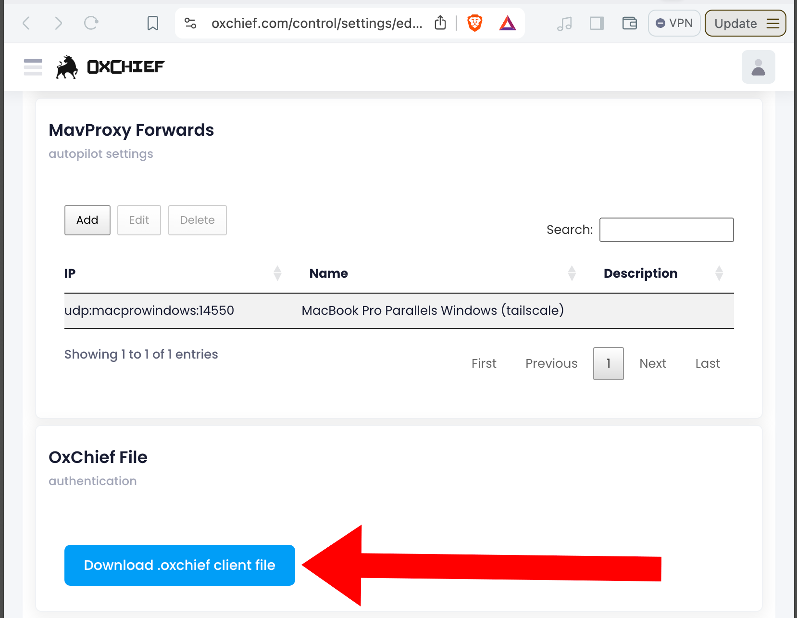

## OxChief Mower Client Software Setup

Follow these steps to get the OxChief software running on your mower's Raspberry Pi. 

### Prereqs

1. Cube Autopilot connected to Raspberry Pi with [OxChief Adapter Set](https://shop.oxchief.com/products/oxchief-raspberry-pi-to-cube-autopilot-adapter-set)
1. OxChief autopilot electronics box set up by following this [guide](ELECTRONICS_BOX_SETUP.md)

2. You can shell/login to your mower's Raspberry Pi (i.e. via something like `ssh pi@mypi`)
3. Docker is installed on the Pi, i.e.:
```
sudo apt update
sudo apt install docker.io -y
sudo systemctl start docker
sudo systemctl enable docker
sudo usermod -aG docker $USER
```
4. (Optional, recommended) [Tailscale](https://tailscale.com/) VPN installed on your Raspberry Pi and your laptop. 

Now you should have Docker installed on your Raspbery Pi. OxChief uses Docker to run on your Pi in an isolated unit called a "container".

We recommend Tailscale (or whatever VPN you prefer) so that you can shell into the Pi on your robot anywhere/anytime as long as the Pi has a network connection (i.e. pi USB tethered to phone's data connection).

### Prepare your Cube Orange Flight Controller
Install ArduPilot Rover firmware on Cube Orange

1. Download [Mission Planner](https://ardupilot.org/planner/docs/mission-planner-installation.html)
2. Connect Cube Orange to your PC via USB
3. Install [Arudpilot Rover Firmware](https://ardupilot.org/rover/docs/common-loading-firmware-onto-pixhawk.html) on the Cube
4. Upload the [OxChief Ardupilot Bad Boy params](../cfg/OxChief_Cube_Orange_Bad_Boy_Params_2024_11_20.param) to your Cube Orange via:
```
Mission Planner --> Config --> "Full Parameter Tree" --> "Load from file" and then "Write Params"
```
5. Calibrate Cube Orange [accells](https://ardupilot.org/rover/docs/common-accelerometer-calibration.html). 
6. Calibrate Cube Orange mag via [Large Vehicle MagCal](https://ardupilot.org/rover/docs/common-compass-calibration-in-mission-planner.html#large-vehicle-magcal) button in Mission Planner.


Your Cube Orange flight controller is now ready to connect to the OxChief client.

### Installing the OxChief Mower Client
1. On your mower's Raspberry Pi, pull in the oxchief source like this:
```
mkdir -p /home/pi/src/oxchief
cd /home/pi/src/oxchief
git clone https://github.com/oxchief/oxchief-client.git
```
2. Create an account/subscribe on [OxChief](https://oxchief.com/signup/) (first 14 days are free)
3. Add robot in OxChief via https://oxchief.com/control/settings/ --> "Add Robot"


4. Download the `.oxchief` file for your robot from https://oxchief.com/ --> Click "Settings" tab --> Under "Robot Configuration" click your robot --> Scroll down settings page to "OxChief File" and click the blue "Download .oxchief client file" button.

5. Copy `.oxchief` file to your robot at `/home/pi/src/oxchief/.oxchief`
6. NEVER SHARE your `.oxchief` file. This file authenticates your robot to the OxChief server. 
7. Start oxchief on your Raspberry Pi vi:
```
cd /home/pi/src/oxchief/oxchief-client
sudo ./re.sh
```
8. Log in to [OxChief](https://oxchief.com/) and verify your robot is connected and ready:


9. View OxChief client logs via:
```
cd /home/pi/src/oxchief/oxchief-client
./logs.sh
```
10. Enable OxChief client on Raspberry Pi start via:
```
cd /home/pi/src/oxchief/oxchief-client
sudo cp ./services/oxchief-autopilot-client.service /etc/systemd/system/
sudo systemctl daemon-reload
sudo systemctl enable oxchief-autopilot-client.service
```
