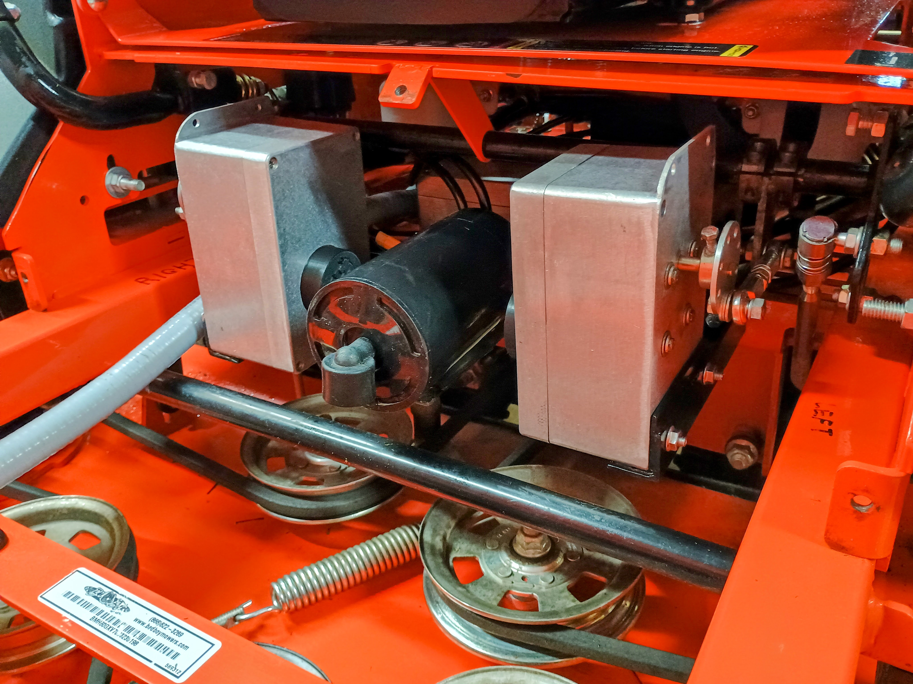
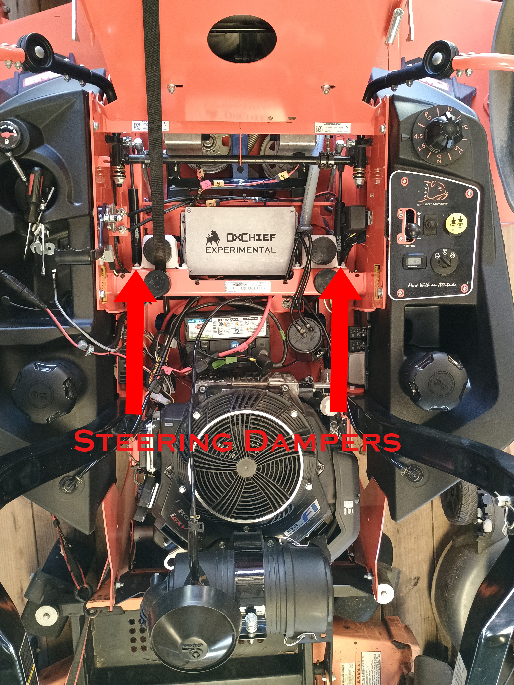
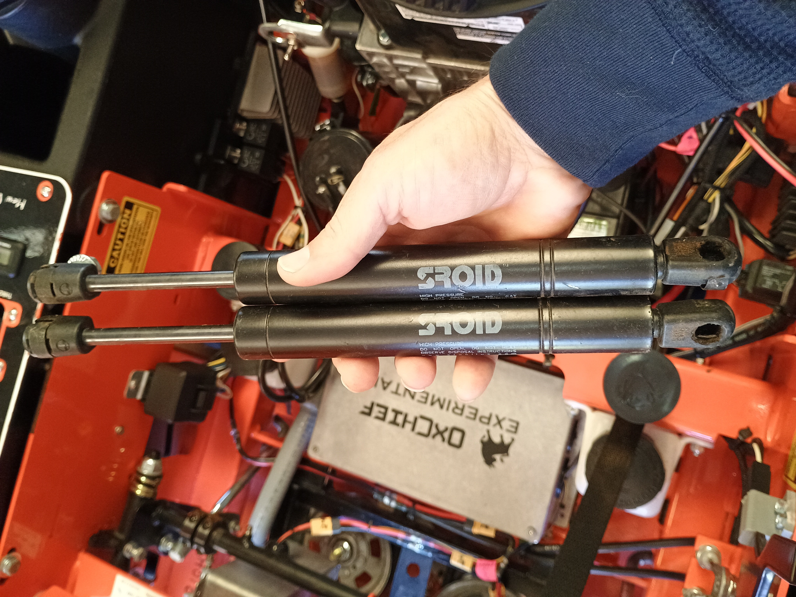
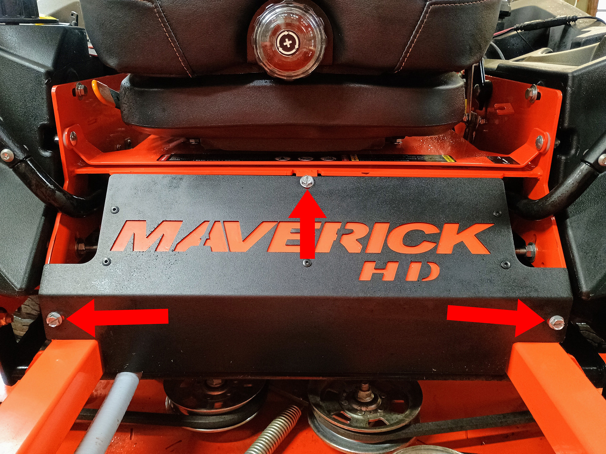
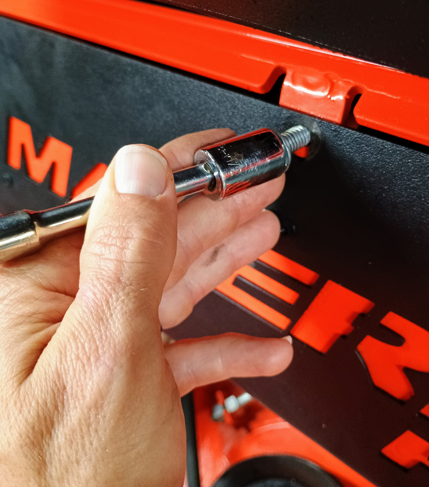
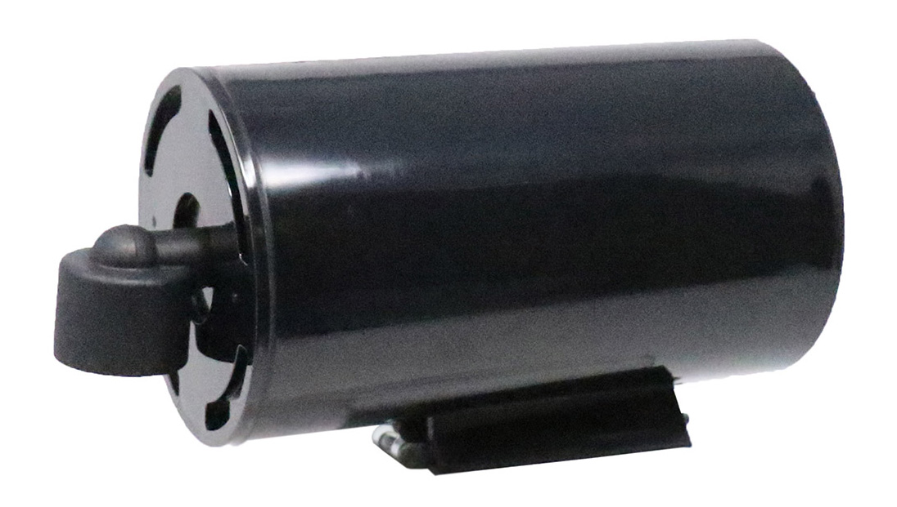

## Adding Robotic Control to Your Mower

How is it possible that we sent a man to the moon in 1969, yet basically no-one has a self-driving zero-turn mower?

For all the promise of tech, half a century after Apollo 11, all across the USA, every Saturday for 8+ months a year, one guy after another sits on a mower, repeats roughly the same pattern, and 30 minutes or 10 hours later, returns the mower to it's home. Repeat next week.

I actually enjoy mowing, to an extent. It was my first job. You get a nice feeling of accomplishment from creating a manicured and striped swath of grass. Mowing is fine, but OxChief believes that sitting on the mower should be optional.

One day very soon, barring acts of God, or other unexpeted world craziness, nearly every zero-turn mower will have autopilot. When you install OxChief, you are pioneering the future of turf maintenance.

Since your mower wasn't shipped with the hardware necessary for running OxChief, we're going to add it ourselves. The most significant lift is the procedure we detail on this page: adding mechanical control to our mower. Follow the steps outlined below to equip your Bad Boy Maverick HD with the OxChief servo assembly.

### Parts List

1. [OxChief Alpha Servo Bolt-On Servo Assembly](https://shop.oxchief.com/products/oxchief-alpha-bolt-on-servo-assembly)
5. Wire stripper tool like [this](https://www.amazon.com/dp/B000JNNWQ2)
6. Heat shrink solder like [this](https://www.amazon.com/dp/B0BKSJQC9Q)
7. Heat gun like [this](https://www.amazon.com/dp/B004NDX7O6)
8. 14 gauge red/black wire like [this](https://www.amazon.com/dp/B09GJLGHM6/)
8. [Loctite](https://www.amazon.com/Loctite-Heavy-Duty-Threadlocker-Single/dp/B000I1RSNS/)
8. Female breadboard (2.54mm Dupont) wires like [this](https://www.amazon.com/EDGELEC-Breadboard-Optional-Assorted-Multicolored/dp/B07GD2BWPY)
9. Zip ties like [this](https://www.amazon.com/dp/B00L2LGMO4/)
9. [Electronic grade silicone](https://www.amazon.com/dp/B0063U2RT8/)
9. 2.5 Allen key / H2.5 hex socket for bolting the Wingxine servos to the enclosures
10. 3/16" Allen key / hex socket for tightening servo linkage collars
11. 7/16" wrench for adjusting linkage
12. 3/8" wrench for adjusting linkage
12. 1/2" socket (or wrench) for removing name plate
13. 10mm wrench for removing carbon canister
13. Drill / drill bit for drilling the servo assembly mounting holes

### Watch: Installation Video

Check out the video for detailed instructions. The video is specifically for the OxChief R/C system, but the servo mounting process is the same.

Or view on YouTube: https://www.youtube.com/watch?v=iwFl5_PJkDQ

### Terminology

For the purpose of our discussion, let's designate "left" and "right" servos to be on the left and right sides of the mower as you sit on the mower. In other words, when you sit on the mower's seat and your left hand rests on a control lever, we're going to call that lever the left lever. Accordingly, the servo that we will attach to that lever is the left servo.

### Summary of Steps
We're adding mechanical control to your Maverick HD.

Note that the "Maverick HD" name plate is removed above so you can see where we'll install the OxChief servo assembly beneath the seat.

### Mount Servo Assembly on Your Mower
Follow these steps to mount the OxChief servo assembly on your mower:

1. Locate the control arm steering dampers. These dampers interfere with the servo's ability to operate the control arms.

1. Remove the left damper.
1. Remove the right damper.
1. Once we've removed the dampers, we can set them to the side.

1. Observe the front "Maverick HD" name plate.

1. Remove the front "Maverick HD" name plate from Bad Boy by removing the three 1/2" bolts that secure it to the frame.

2. Remove the black cylindrical carbon canister that's mounted underneath the seat by unscrewing the 2 bolts that mount it to the mower. Do not unplug the hoses on the carbon canister -- just set it to the side for now. Later on, we will relocate this canister to the metal plate on the OxChief servo assembly between the servo enclosures.

3. Set the servo mount in place, centering it on the servo mounting lip beneath the seat.

Now the servo assembly is mounted on your mower and you are ready to connect the servo linkage to your mower.

### Attach the servo linkage to your mower

The OxChief servo assembly is designed to give the autopilot robust control of the mower while not interfering with the normal operation of the contol levers. Notice that an adjustable jack screw sits between the two ball joints connecting the servo plate to the teardrop-shaft-collar-connector. This screw provides approximately 1" of adjustment, enabling you to precisely adjust the servo connection to the autopilot.

Attach the servo linkage to the mower by following these steps:

1. On the left teardrop-shaft-collar-connector, remove the top of both shaft collar connectors by removing the 4 hex/Allen bolts with a 3/16" hex wrench or 3/16" hex socket.
2. Now connect the left teardrop-shaft-collar-connector to the mower shaft by sandwiching the collar connector bottom and top over the left hand drive arm actuator shaft. You will tighten the 4 bolts connecting the top of the collars down with the a 3/16" hex socket. Take care to screw down the bolts evenly -- i.e. you want the collars sitting flush on the drive arm actuator. Before snugging up the bolts, eye the clearance between the top and bottom of the shaft collar. You want this space to be approximately identical for all 4 bolts. Don't tighten the hex bolts all the way down yet -- we want to leave the collars where they will slip on the mower shaft until we have identified the exact place to tighten them.
3. Repeat step #2 above for the right teardrop-shaft-collar-connector.
4. Now we will nail down the ideal location for the collar connectors on the drive arm actuator shaft. You have 2 axis of movement to adjust, i.e.:
- The left and right position on the shaft
- The rotation position around the shaft
5. Now let's adjust the horizontal positional of the left-hand servo linkage. For the horizontal (i.e left and right) position of the collar, you want to slide the collar along the shaft until the ball-joint-jack-shaft linkage is aligned as perfectly straight as possible. Once you've found this position, you may want to mark it on the drive arm actuator shaft for future reference.
6. Now we want to adjust the rotational position of the left-hand teardrop-shaft-collar-connector so that when the bottom of the connector is at the very bottom possible vertical position (i.e. when it's at 6 o'clock) -- this position should correspond to the mower left control lever handle being exactly half-way between full-speed forward and full-speed reverse. In other words, we want the teardrop-shaft-collar-connector at the very bottom vertically (and centered horizontally) when the mower's control handle is in the exact middle of it's range of motion. Note that we use this cumbersome description of the mower control arm being "at the middle of it's range of motion" deliberately -- i.e. this is not the same as the neutral position where the rear wheel doesn't move and you can lock out the control arm in the neutral position slot. The reason is this: notice that the mower control arm has more throw in the forward range of motion than in the reverse range of motion. So, just to state things another way, when the mower control arm is halfway between full-speed forward and full-speed reverse, it's actually in a place where the rear wheel is spinning forward. And so, to bring this discussion to a close, we want to find the midway point for the control arm and then snug down the teardrop-shaft-collar-connector to the shaft at this point. Before your final tightening, apply removable Locitite to the hex bolts to ensure the connection remains tight in the presence of considerable vibration.
7. Now we want to adjust the left servo plate so that it's 6 o'oclock position corresponds to
the teardrop-shaft-collar-connector's 6 o'clock position. Stated another way, when the point where the linkage connects to the servo plate is at the very bottom of it's vertical rotation (and thus in the exact middle of it's horization rotation), we want the teardrop-shaft-collar-connector at the bottom/middle of it's rotation. We achive this by adjusting the linkage jack screw until we reach this point. Adjust the jack screw slowly until you're satisfied that you've found the point where the rotation of the servo plate matches perfectly to the rotation of the teardrop connector. Now tighten the 2 nuts against the ball
joints so that the jack screw is secured in place. Ensure that the ball joints are aligned with
eachother and that they are free to move as needed throughout the mower handle's range of motion.
8. Now it's important to test moving the handle all the way through it's entire range of motion -- forward and back -- and observe the movement of the servo plate and the entire linkage assmbly. The movement should be smooth. When you push the arm all the way forward and backward, the linkage should pull the servo plate to a location that's slightly less than vertically inline with the servo shaft. If the servo plate were pulled to where the linkage connection is vertically inline with the servo shaft, then the handle could become stuck at the worst possible location. To ensure that the servos are adjusted well, we're wanting test the motion my moving the handles aggressively forward and back, and ensuring that they are free to move and that they don't get stuck anwhere in the range of motion. Please don't skip this step -- only proceed once you're confident that the servo linkage will not interfere with the handle's normal range of motion.
9. Repeat steps 5-8 for the right hand servo linkage.

Now we've successfully mounted the OxChief servo linkage on our mower. There is one more servo adjustment -- this is where we tell the Wingxine servos the neutral position of the mower handles.

### Setting the Neutral Position on the Wingxine Servos

For both the left and right Wingxine servo motors, we have to tell the servo motor what point to consider "center". This is simply the Neutral/Home position for the left and right control lever -- i.e. the point where the rear wheel is neither spinning forward nor backward, and where the control level can slide over into the home resting slot.

Follow this procedure:

1. Power OFF Bad Boy engine. 
2. Ensure that the mower control handles can move freely back and forth -- i.e. they are not
locked in the home position slots.
3. Power on the OxChief autopilot electronics
3. Power on the Wingxine servos
3. Heads up: the Wingxine servo center functionaliy requires that a pwm signal is being
sent to the servo in order for the centering to work. So, for instance, when your ArduPilot
autopilot is turned on and it's in the default Hold mode, it's sending a pwm value of
something like 1500 μs (i.e. the SERVO1_TRIM or SERVO3_TRIM value) to the servo. If you
only turn on the Wingxine servos without powering on the autopilot, there is no signal
on the wire, and even though the center LED light will appear to enter centering mode (explained below) when you click the center button, the centering functionality will not engage and you may incorrectly think that the servo centering is not working. All that just to say: make sure the autopilot is turned on.
4. Remove the cover from the left OxChief servo enclosure.
5. On the servo PCB, note that the green LED flashes once followed by roughly 1 second off.
6. Click the "center" button on the servo PCB. Now note that the green LED flashes twice followed by roughly 1 second off. This means you are in centering mode. 
7. With a small screwdriver, slowly turn the center adjustment screw in the blue trim pot next to the center button. The servo should move the handle either forward or backward depending on which way you
are turning the centering screw. Turn the screw until the control handle is exactly in the netural
position (i.e. the handle can move into the home slot and the left wheel would be exactly still, moving neither forward or backward).
8. Now that the mower control handle is in the netural position, end the center procedure by
clicking the "center" button again on the Wingxine PCB. Now the green LED should resume flashing
only once, and you have successfully centered your servo.
9. Repeat steps 4-8 for the right servo.

Congratulations! The OxChief Bad Boy Maverick HD autopilot servo assembly is now successfuly installed
on your mower.